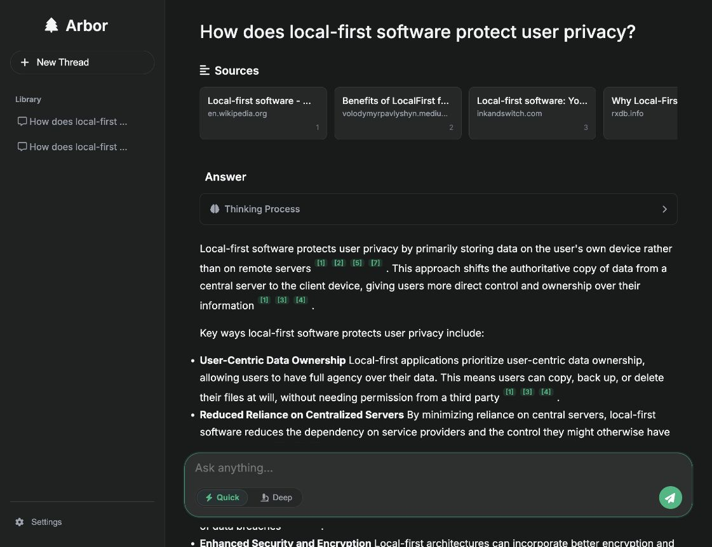

# Arbor — Deep Research AI

Arbor is a Flask research assistant that searches the web, reads the most relevant results, and produces a cited answer. Quick mode keeps the source set focused for everyday questions; Deep Research builds a longer structured report.



## Highlights

- Streamed progress and answers through Server-Sent Events
- Quick and Deep Research modes
- Search-query refinement with Gemini 2.5 Flash
- Multi-source extraction with `trafilatura` and Beautiful Soup fallbacks
- Inline citations connected to source cards
- Persistent research threads, follow-up questions, sharing, and PDF/DOCX export
- MySQL history when configured, with local JSON fallback
- Responsive dark and light interfaces

## Run locally

```bash
python -m venv .venv
source .venv/bin/activate
pip install -r requirements.txt
cp .env.example .env
python app.py
```

Then open `http://127.0.0.1:5000`.

At minimum, add your Gemini API key to `.env`:

```dotenv
GEMINI_API_KEY=your_api_key_here
FLASK_SECRET_KEY=replace_with_a_random_secret
```

MySQL is optional. If these values are absent or the connection is unavailable, Arbor stores history in the local JSON fallback:

```dotenv
DB_HOST=localhost
DB_USER=root
DB_PASSWORD=
DB_NAME=arbor
```

Never commit your real `.env` file or exported research history.

## Project layout

```text
app.py                 Flask API, research pipeline, persistence, and export
templates/index.html   Main application shell
static/css/style.css   Responsive interface and themes
static/js/script.js    Streaming, citations, history, settings, and sharing
gunicorn.conf.py       Production server configuration
```

## Notes

Search and scraping depend on third-party sites, so individual sources may reject automated access. Arbor keeps usable search snippets as a fallback and continues when some pages cannot be extracted.
